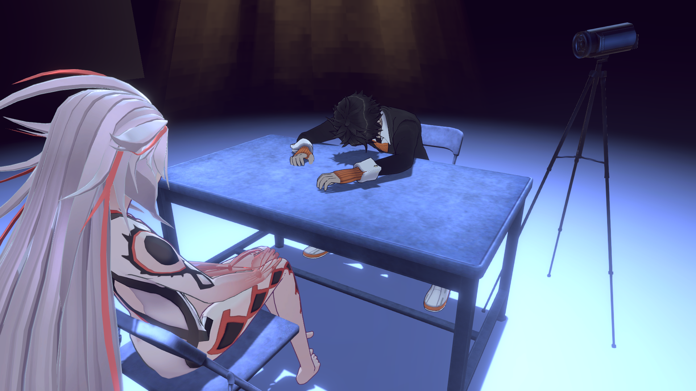

# SomniumCustomFixes
A mod written to help with increasing the visual quality in games within the _AI: The Somnium Files_ series.

The development of this mod was inspired by ["AISomniumFiles2Fix"](https://codeberg.org/Lyall/AISomniumFiles2Fix), updated for the latest MelonLoader/BepInEx and Il2CppInterop versions, and features a lot more flexibility with its configuration.

## Supported titles
- [_AI: THE SOMNIUM FILES - nirvanA Initiative_](https://store.steampowered.com/app/1449200)
- [_No Sleep For Kaname Date - From AI: THE SOMNIUM FILES_](https://store.steampowered.com/app/2752180)

## Supported loaders
- MelonLoader: v0.6.0 or newer
- BepInEx:
  - **[_AINI_]** v6.0.0-be647 or newer
  - **[_AINS_]** v6.0.0-be700 or newer

## Features
- Visual quality upgrades:
  - Automatically enables supported antialiasing on applicable `UniversalAdditionalCameraData` objects:
    - Fast-Approximate AntiAliasing (FXAA)
    - Subpixel Morphological Anti-Aliasing (SMAA)
    - **[_AINS_ only]** Temporal Anti-Aliasing (TAA)
  - Force-enabling anisotropic filtering on textures, and increasing texture filtering quality in general
  - Increasing the resolution and quality of generated shadowmaps to a configurable value, ranging from a resolution of 2562 to 40962 (_AINI_)/81922 (_AINS_)
  - Greatly increasing the distance at which character models fade between levels-of-detail (LoDs)
  - Other, smaller miscellaneous adjustments
- Optional stylistic toggles:
  - Enabling/disabling the outlines around character models
  - Enabling/disabling motion blur
- Miscellaneous toggles:
  - Enabling/disabling whether the mouse cursor appears
- Most of these additions are user-configurable, and are stored in their own configuration file--See the [Example configuration files](#example-configuration-files) section for an example

#### Planned additions for future releases
- Implementing the fixes for ultrawide displays from the original mod
  - Cannot implement until either Il2CppInterop fixes how it interacts with nullable parameters, or I find a decent workaround
- Further visual quality improvements and additional preferences to adjust them

## Visual comparisons of quality improvements

<i><b>AI: THE SOMNIUM FILES - nirvanA Initiative</b></i>

| Without mod | With mod, default settings |
| :-: | :-: |
|  |  |
|  |  |

---

<i><b>No Sleep For Kaname Date - From AI: THE SOMNIUM FILES</b></i>

| Without mod | With mod, default settings |
| :-: | :-: |
|  |  |
|  |  |

## Example configuration files
- MelonLoader - [`UserData\SomniumCustomFixes.ini`](_RepoAssets\ExampleConfig_MelonLoader.ini)
- BepInEx - [`BepInEx\config\org.Wryyyong.SomniumCustomFixes.cfg`](_RepoAssets\ExampleConfig_BepInEx.cfg)
